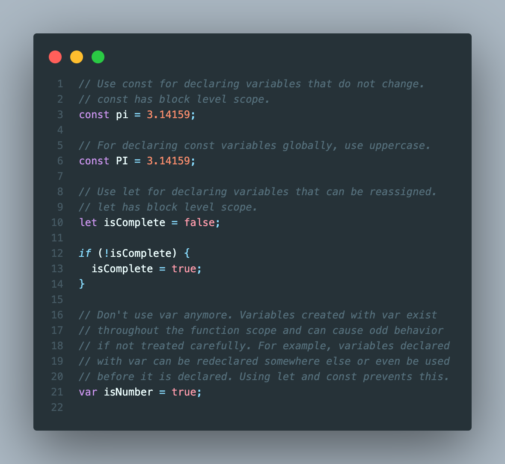
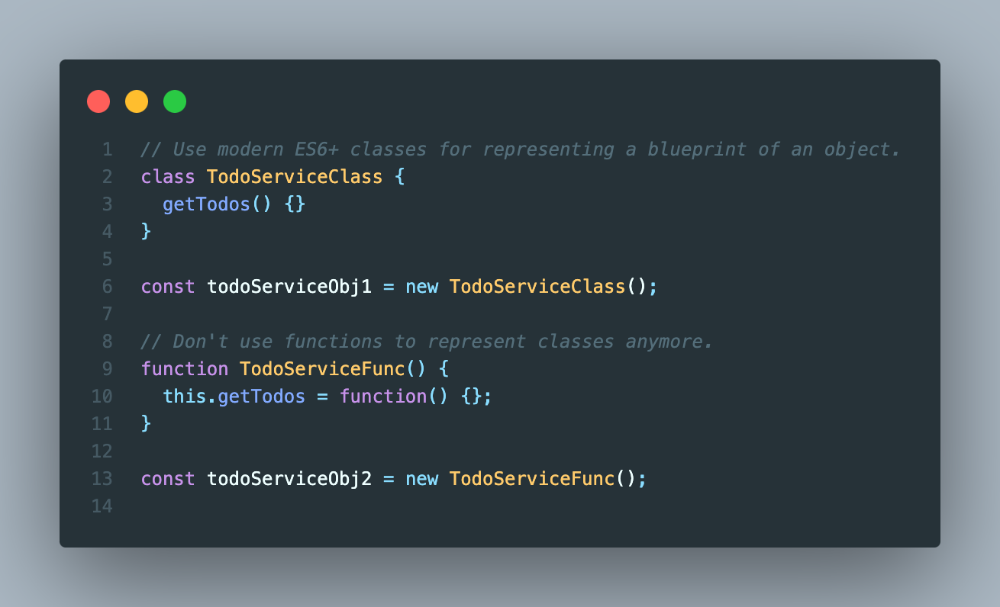
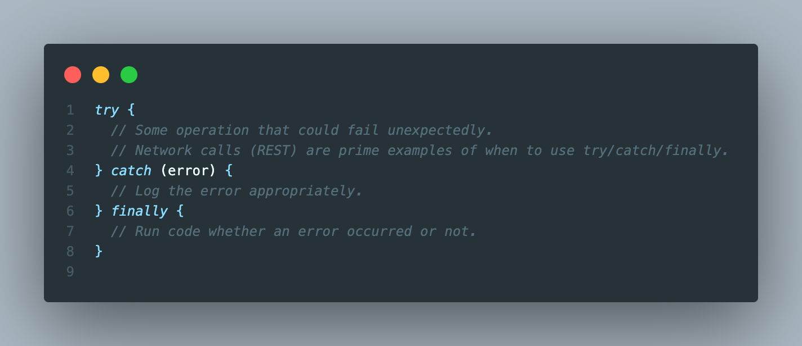
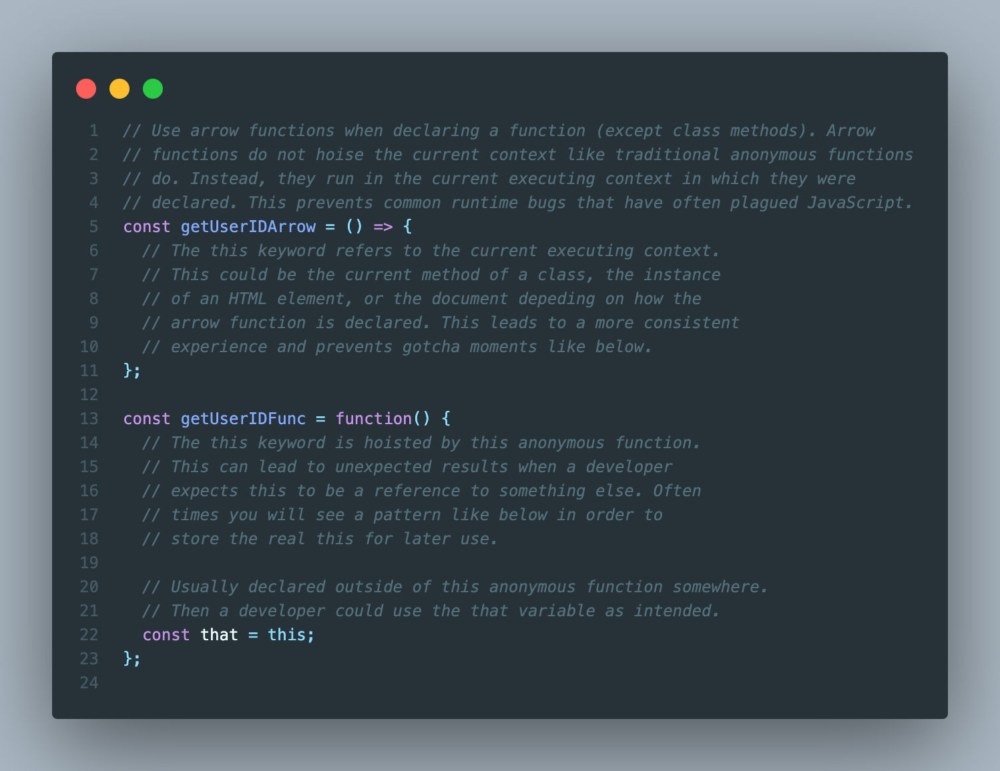
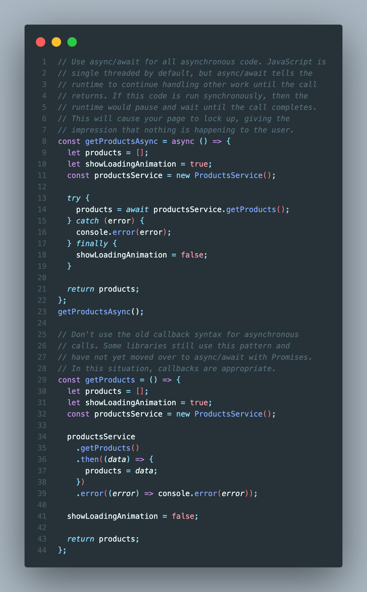

# JavaScript Best Practices

With the release of ECMAScript 2015 (ES6) in June of 2015, <write about the modern features that brought JS in line with other modern languages like C#, Kotlin, and Swift>

## Use modern variable declaration

## Use classes over function classes

## Use try/catch/finally for handling exceptions

## Use arrow functions (lambdas) over anonymous functions

## Use async/await for asynchronous code

