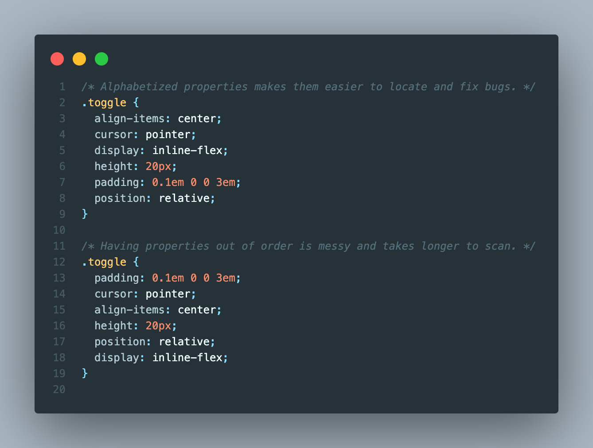
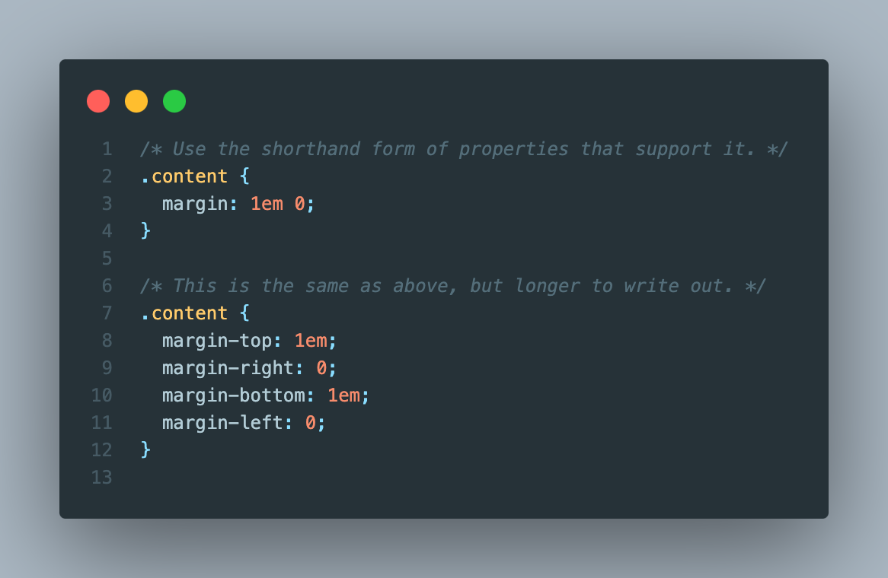
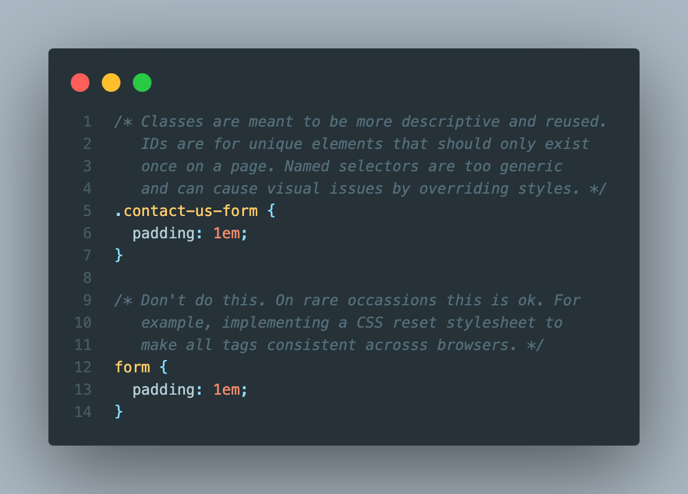
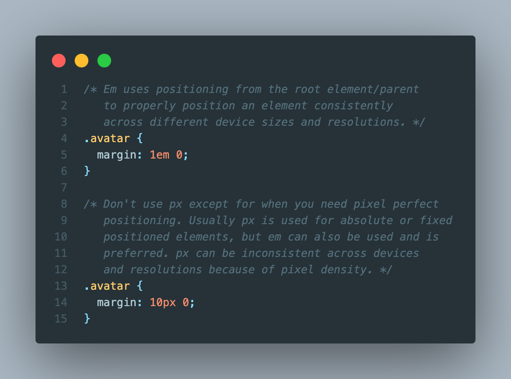
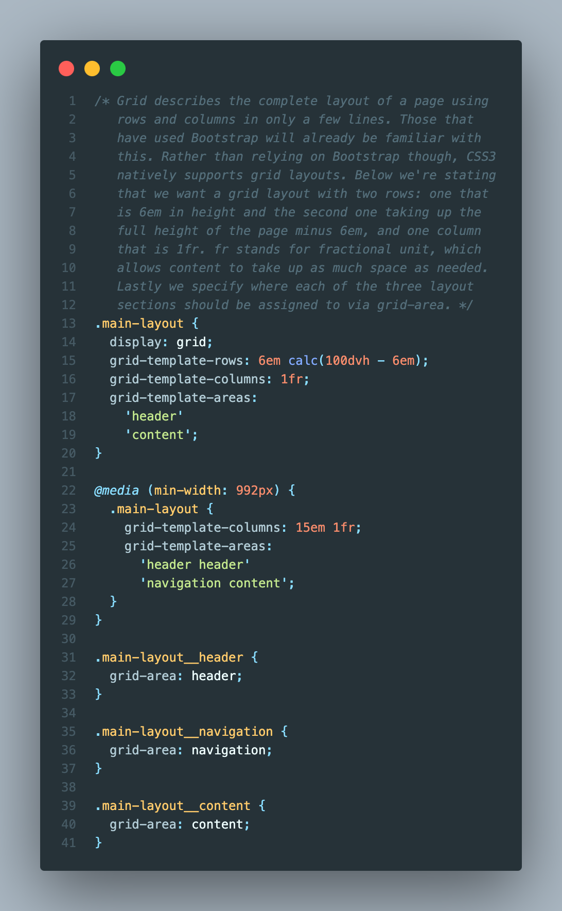
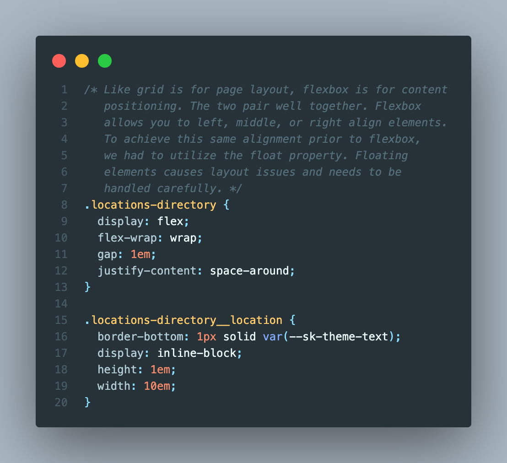
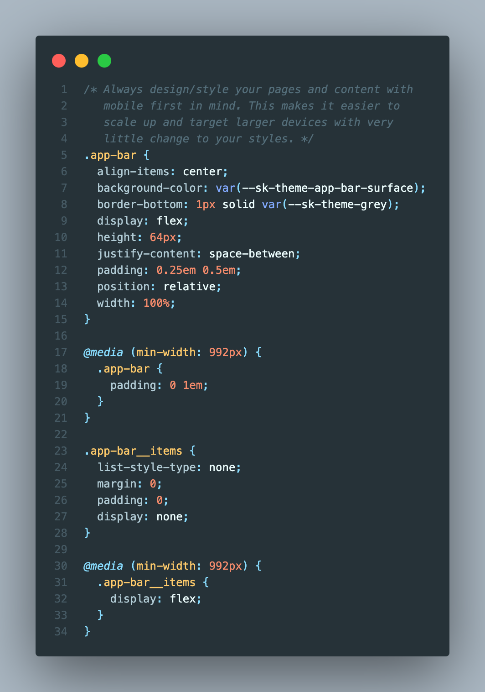

# Best Practices

CSS. This short three letter acronym that strikes fear into many developers. The amount of selectors and properties to memorize is endless you say? Fear not! Below is a list of best practices to follow that will get you most of the way on your journey to CSS Mastery.

## Alphabetize selector properties

## Use the shorthand form of properties

## Use classes over id and name selectors

## Use em for positioning elements

## Use grid for page layout

## Use flexbox for aligning elements on a page

## Always style for mobile first, then tablet, and desktop

