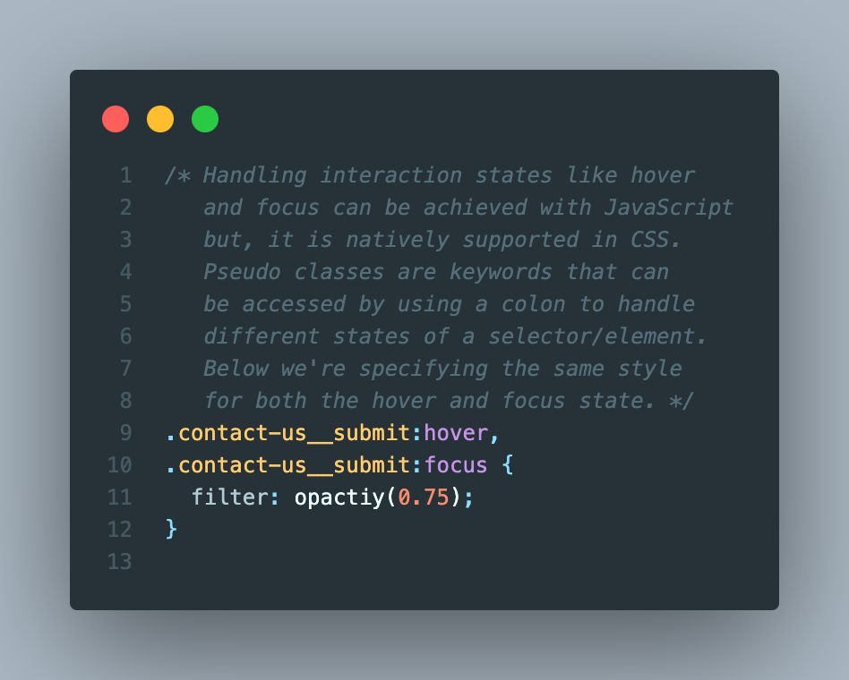
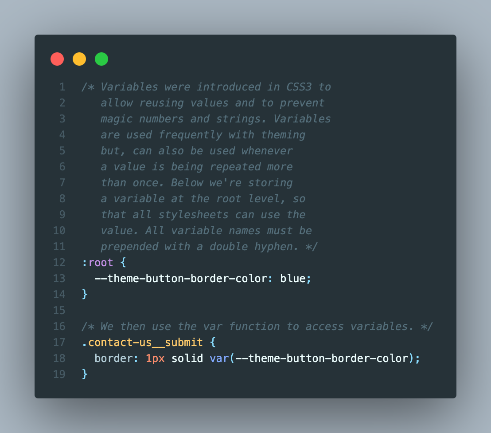
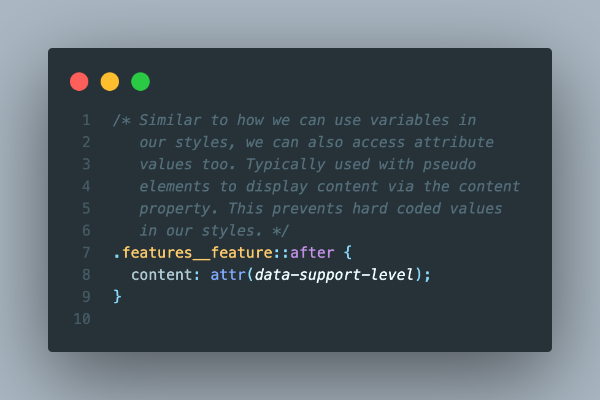
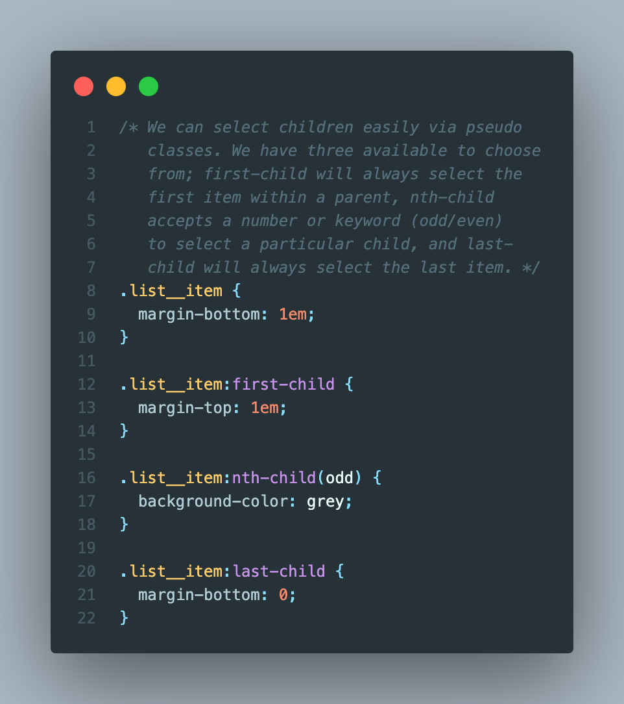
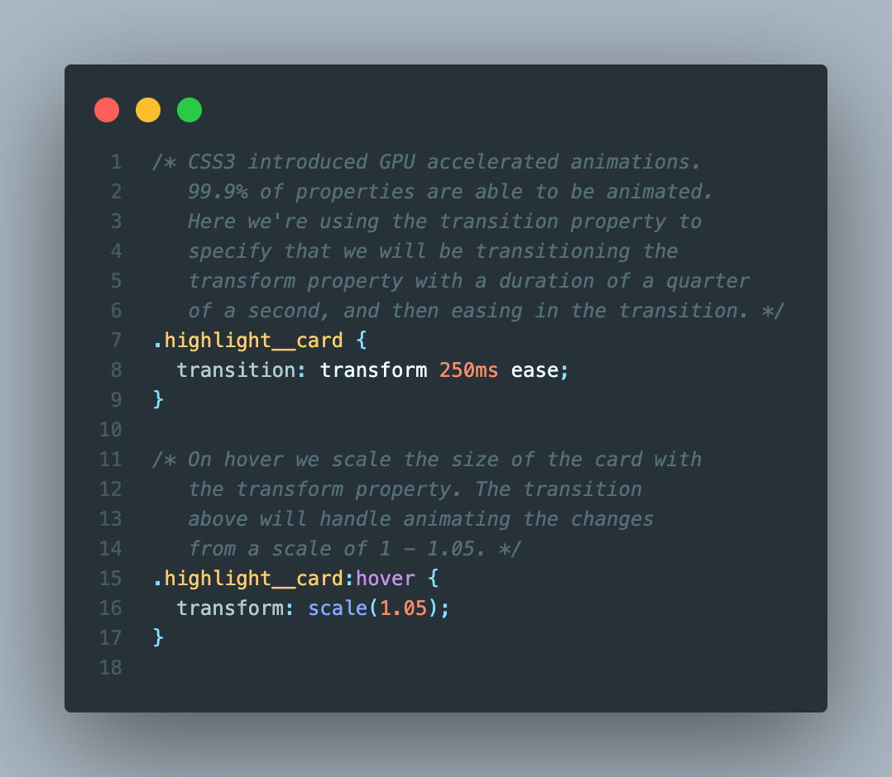

# Tips & Tricks

While manifesting CSS genius, always wear your tin foil hat. Or, you can use these tips & tricks below and look like a rock star!

## Centering content horizontally

## Give rounded corners to content

## Customize a button's default look

## Use pseudo classes for state management

## Create variables for reusable values

## Use the attr function to access element attributes

## Selecting specific children in a list of items

## Easily implement animations

