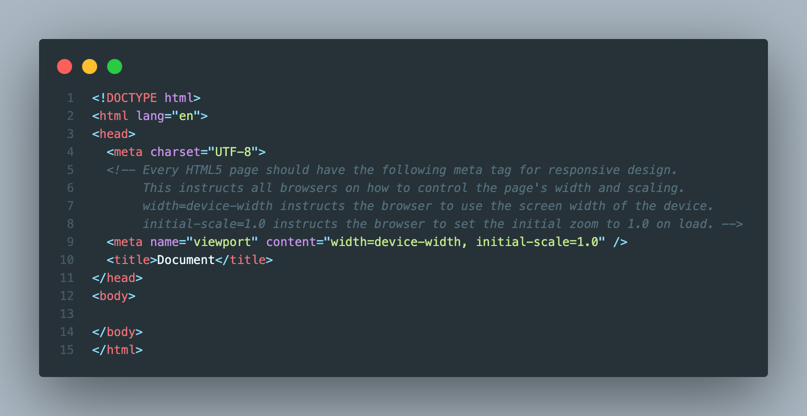

# HTML 5

TODO: ADD SUMMARY

## Always include a lang attribute for accessibility

## Always include a responsive viewport meta tag

## Always include a title tag for every page

## Always list link stylesheet tags after all meta tags

## Use defer when loading external scripts

## Use the correct tag that symantically makes sense

## Use data attributes to store additional data

## Use aria attributes for better accessability

