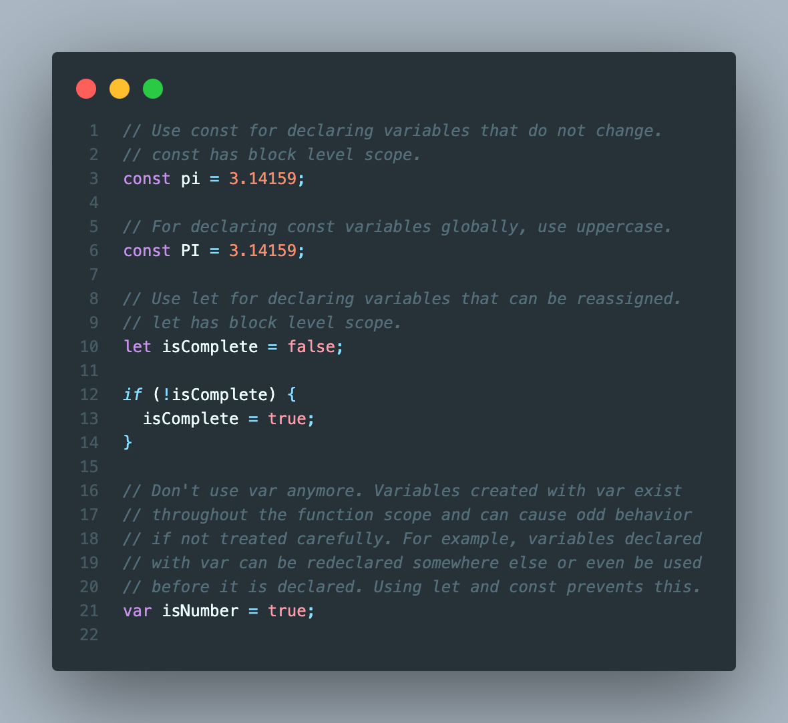
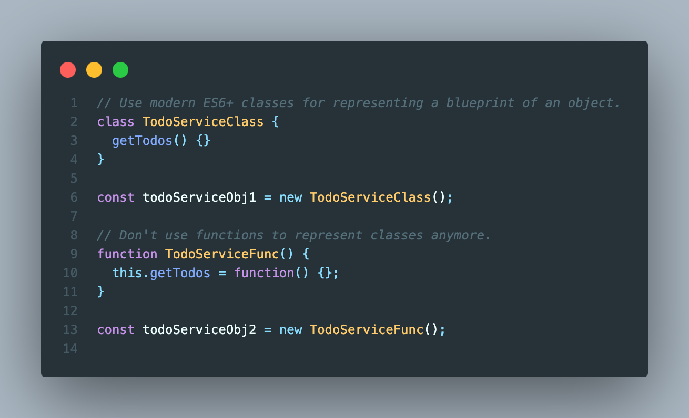
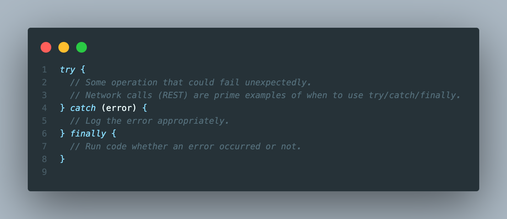
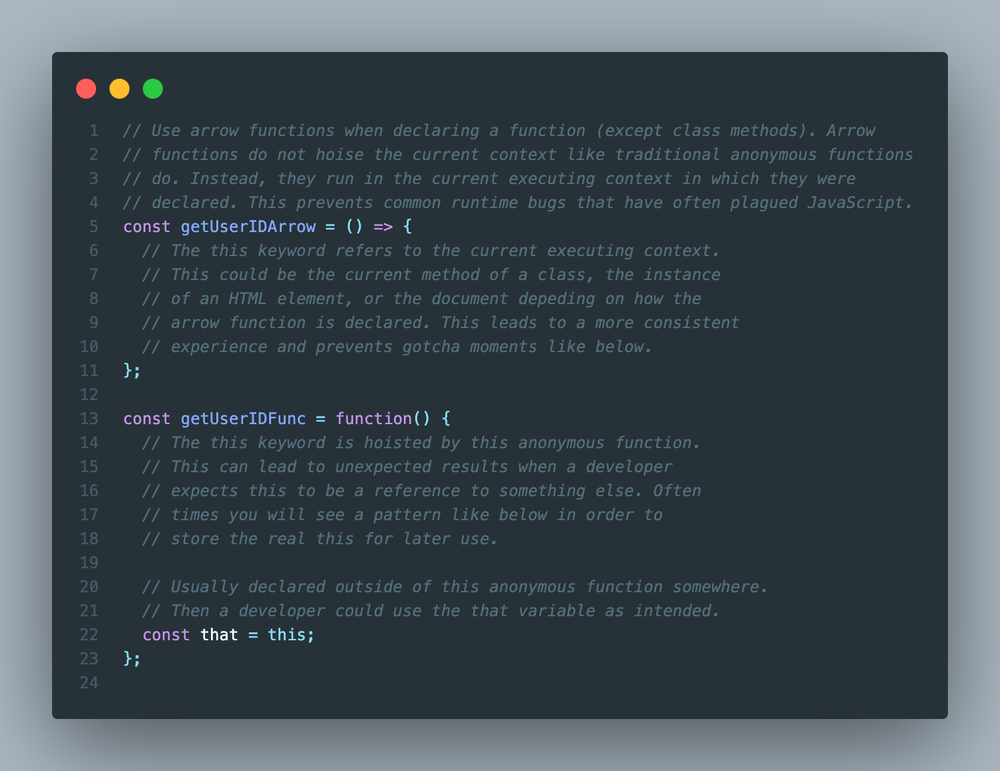
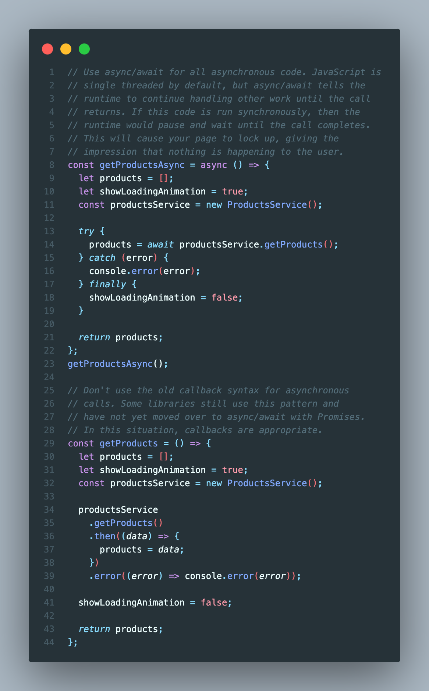
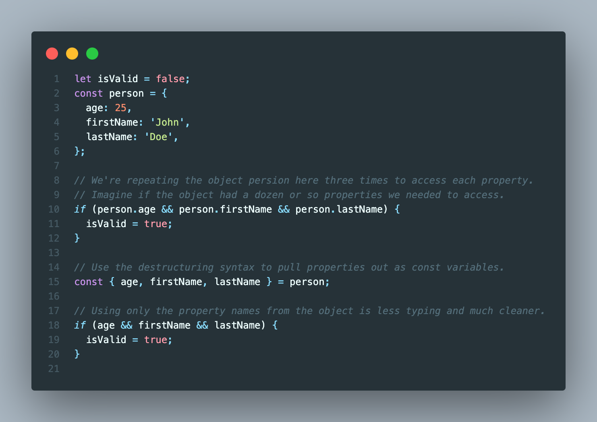
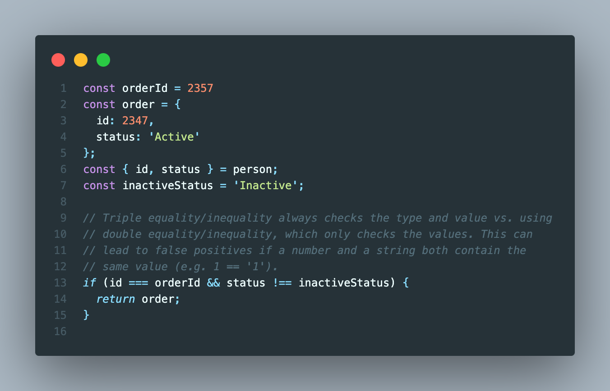
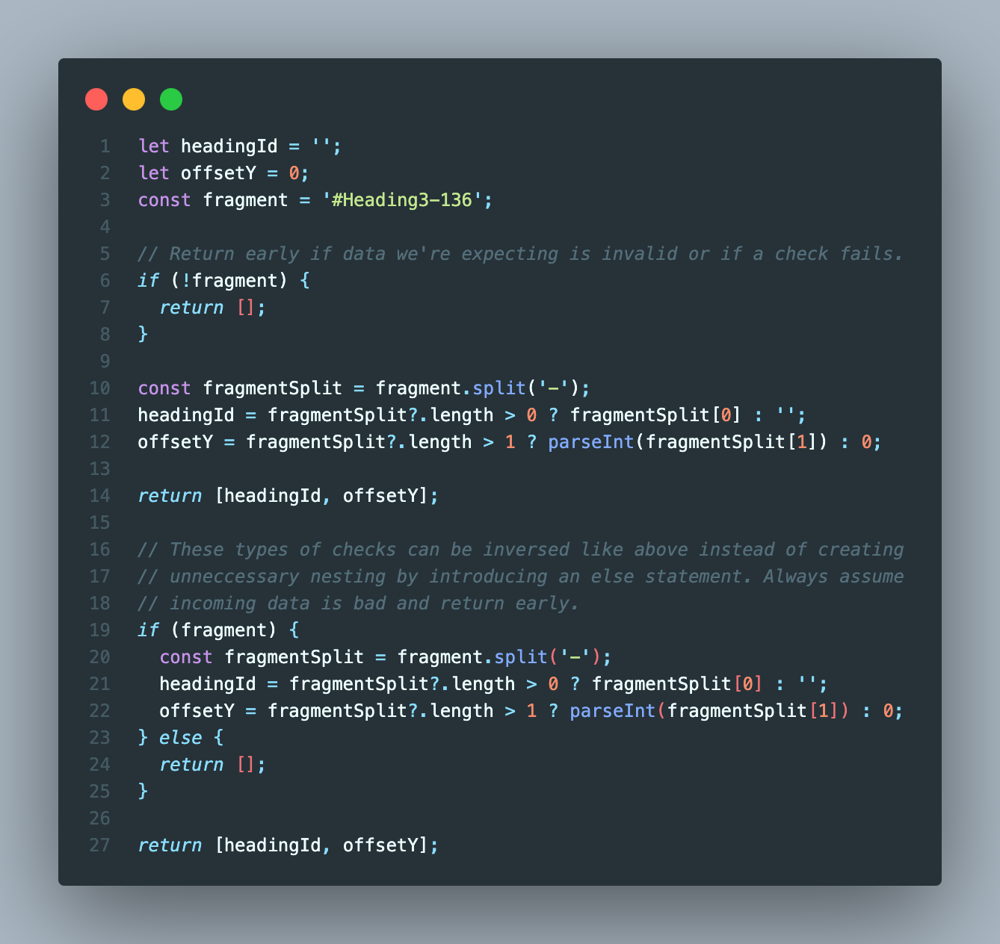

# Best Practices

With the release of ECMAScript 2015 (ES6) in June of 2015, JavaScript received several new features and syntax improvements that places it amongst other modern languages like C#, Kotlin, and Swift. Below is a set of best practices we encourage you to use to help you write cleaner, more predictable code.

## Use modern variable declaration

## Use classes over function classes

## Use try/catch/finally for handling exceptions

## Use arrow functions (lambdas) over anonymous functions

## Use async/await for asynchronous code

## Use the new destructuring syntax to pull individual properties from objects

## Always use triple equality/inequality operators in comparison checks

## Always return early if data is invalid or a check fails

