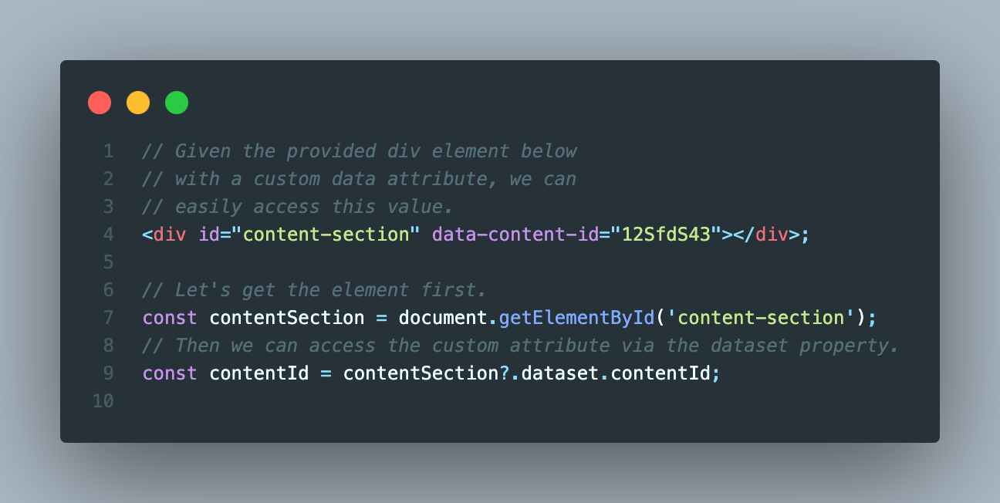

# Tips & Tricks

TODO: SUMMARY.

## Create GUIDs without 3rd party libraries

## Access custom data atrributes

## Prevent classes from being modified (static classes)

## Access query strings natively

## Access local storage and session

## Locating items in arrays

## Suming up items in an array

## Use Maps for true dictionary key/values

